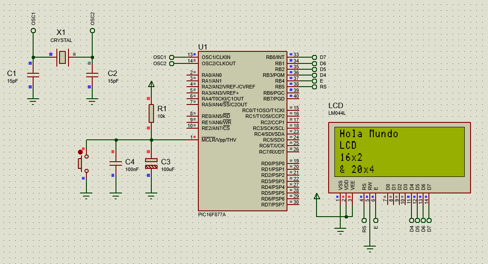

<h1 align="center">Libreria LCD - PICs 🤖</h1>

Esta es una librería para microcontroladores PIC que proporciona funciones para controlar una LCD de 16x2 y 20x4. Con esta librería, puedes enviar comandos y datos a la LCD, y controlar su funcionamiento de manera sencilla.

En el archivo de cabecera **lcd.h** se encuentra la configuración inicial, la declaración de los pines y constantes, de igual forma en el archivo **lcd.c** se encuentra toda la logica del programa.

Además, en el archivo **main.c**, se encuentra un ejemplo de uso de la librería, acompañado de sus archivos de cabecera **config.h** y **fuses.c**. Estos últimos son responsables de configurar tanto el cristal como los fusibles del microcontrolador PIC utilizado en el ejemplo (PIC16F877A).


## Características

- Soporte para pantallas LCD de 16x2 y 20x4.
- Control de posición del cursor.
- Envío de comandos y datos a la LCD.
- Funciones para escribir y limpiar la pantalla.


## Funciones - Metodos

| Función                | Descripción                   | Parámetros                           |
| ---------------------- | ----------------------------- | ------------------------------------ |
| `LCD_Init();`          | Inicializa la LCD             | Ninguno                              |
| `LCD_SetCursor(y, x);` | Posiciona el cursor de la LCD | `y`: fila [0-3], `x`: columna [0-19] |
| `LCD_Print(*string);`  | Imprime en la LCD             | `*String`: Texto                     |
| `LCD_Clear();`         | Limpia la LCD                 | Ninguno                              |
| `cmd(cmd);`            | Escribe comandos en la LCD    | `cmd`: Comando                       |
| `str(cmd);`            | Escribe un dato en la LCD     | `cmd`: Char - Dato                   |


Nota🗒️: Las funciones cmd() y str() son de uso interno y no es necesario utilizarlas directamente. Sin embargo, si se posee un conocimiento avanzado de su funcionamiento, es posible implementarlas para enviar comandos personalizados y caracteres. Se recomienda precaución al hacer uso de estas funciones, ya que podrían afectar el funcionamiento general de la LCD. 


## Conexiones

```
       PIC                       LCD
╭───────────────╮         ╭──────────────╮
│      RB0      │--------►│      D7      │
│      RB1      │--------►│      D6      │
│      RB2      │--------►│      D5      │
│      RB3      │--------►│      D4      │
│      RB4      │--------►│      E       │
│      RB5      │--------►│      RS      │
╰───────────────╯         ╰──────────────╯

```

Nota🗒️: Si bien se estableció una configuración de pines predeterminada, con el conocimiento necesario, se puede generar variaciones y personalizar la distribución de pines a conveniencia mediante la modificación de los archivos "lcd.h" y "lcd.c".


## Ejemplo




¡Gracias por visitar este proyecto! Si te ha sido útil, no dudes en darle una ⭐ (estrella) al repositorio. Tu apoyo es muy apreciado. Si tienes alguna pregunta, sugerencia o simplemente quieres charlar, estaré encantado de escucharte. No dudes en ponerte en contacto. 📫 yairca3.7@gmail.com


[](https://github.com/ycanas)


